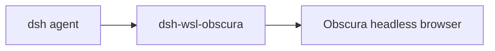

# dsh-wsl-obscura
> **Kit install:** see [dsh-wsl-kit](https://github.com/173787247/dsh-wsl-kit). This plugin is **optional** (headless engine) — not part of `KIT_SET=daily`. Fault tree: [TROUBLESHOOTING](https://github.com/173787247/dsh-wsl-kit/blob/master/docs/TROUBLESHOOTING.md).

DeepSeek Harness tools for **[Obscura](https://github.com/h4ckf0r0day/obscura)** — a Rust headless browser — from **WSL**:

| Tool | Purpose |
|------|---------|
| `obscura_status` | Resolve binary + `--version` |
| `obscura_fetch` | `obscura fetch` with dump / eval / stealth |
| `obscura_mcp_hint` | How to wire MCP / CDP (does not start a server) |

**Not** the same as [`dsh-wsl-browser`](https://github.com/173787247/dsh-wsl-browser) (`win_open_url` opens the Windows **default GUI** browser).

[中文 → README.zh.md](./README.zh.md)

---

## Compatibility

| Field | Value |
|-------|-------|
| **Plugin** | `dsh-wsl-obscura` **0.1.0** |
| **Minimum dsh** | ≥ **0.1.2** (web UI one-shot `?token=` on Windows relay `:3081`) |
| **Latest verified** | See [dsh-wsl-kit Compatibility](https://github.com/173787247/dsh-wsl-kit#compatibility-2026-09) (currently **`0.1.5-rc.1`**) — single source of truth for the suite |
| **Kit set** | optional — **not** in default `KIT_SET` lists |
| **Cloud Flash** | Use model id **`deepseek-flash`** (V4.1 Flash) in `~/.dsh/settings.yaml` / `llm-deepseek` — not configured by this plugin |
| **Agent Teams** | Upstream experimental; not required here |

Suite floor versions: kit [`check-plugin-versions.sh`](https://github.com/173787247/dsh-wsl-kit/blob/master/scripts/check-plugin-versions.sh). Fault tree: [TROUBLESHOOTING.md](https://github.com/173787247/dsh-wsl-kit/blob/master/docs/TROUBLESHOOTING.md).

## Why

Agent work that needs page text, JS eval, or stealth fetch should hit a headless engine. Obscura already builds on Windows (`obscura.exe`). This plugin runs it from WSL via interop (`/mnt/c/.../obscura.exe`).

For richer agent tools (navigate / click / screenshot as MCP tools), prefer **Obscura MCP** (`obscura mcp`) — use `obscura_mcp_hint` for the wiring.

## Prerequisites

1. Build Obscura on Windows (`cargo build --release -p obscura-cli --bins --features render,stealth`).
2. Point the plugin at the binary (any of):
   - `config.binaryPath` in cordis
   - env `OBSCURA_BIN` / `OBSCURA_PATH` (WSL or `C:\...` path)
   - default candidate (local scaffold):  
     `/mnt/c/Users/rchua/Desktop/AIFullStackDevelopment/obscura/target/release/obscura.exe`

## Install

Local clone (recommended while unpublished):

```sh
dsh plugin --profile web add /mnt/c/Users/rchua/Desktop/AIFullStackDevelopment/dsh-wsl-obscura
```

When published:

```sh
dsh plugin --profile web add github:173787247/dsh-wsl-obscura
```

Restart dsh web after add (kit: `scripts/restart-dsh-web.sh`).

## Config

```yaml
- id: dsh-wsl-obscura
  name: dsh-wsl-obscura
  config:
    timeoutMs: 60000
    maxOutputChars: 32000
    defaultStealth: true
    binaryPath: /mnt/c/Users/rchua/Desktop/AIFullStackDevelopment/obscura/target/release/obscura.exe
```

## Tests

```sh
npm test
```

## License

MIT

## Where it sits

Optional. Drives the Obscura headless browser. Not in install.sh.



Suite diagram and version snapshot: [dsh-wsl-kit](https://github.com/173787247/dsh-wsl-kit#how-the-pieces-fit). This plugin is **0.1.0** (not in install.sh). Do not copy that matrix into this README.

